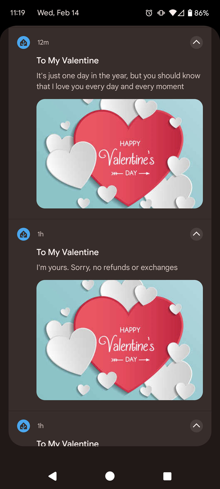
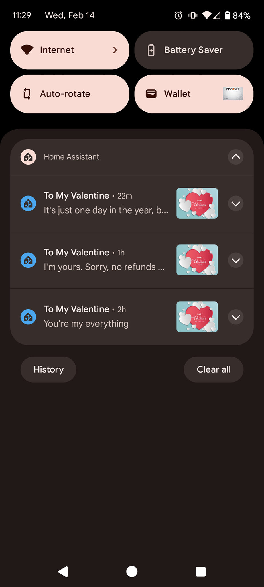

# Valentines automation by HeedfulCrayon

I saw a post where a user (Nate Borup) was sending their significant other an hourly message with an image on Valentine's day.

[Gist](https://gist.github.com/HeedfulCrayon/1a4d9fccdd96baf67cdae5ab8fcce431)

Basically, every hour on Valentine's day, the automation runs. It waits for a random number of minutes and then sends a message with an attached image.

The user has a helper with multiple valentine's sayings and then it selects one from the list. It's not randomly selected, it just goes down the list.

You can this for other events like your anniversary!

I would probably separate this as a package, and put the input_select.valentines_sayings, and input_number.valentines_run_count in the package with this automation. You could even make this a script where you pass the input selector and image_url to the script, that way you could just call it with values for valentine's, anniversary and birthday. (I may do that and post the example.)
