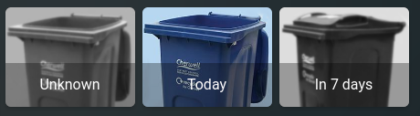

# Blue, Green, Brown bins displayed using conditionals

I created a grouping that displays the bins when they are suppose to go out. They appear the day before.

I use the Waste Collection Schedule integration and then downloaded images of the different bins. I made some that are BW for the "off" effect. It actually uses the state_image of the picture_entity to display the different states/colours of the bins.
