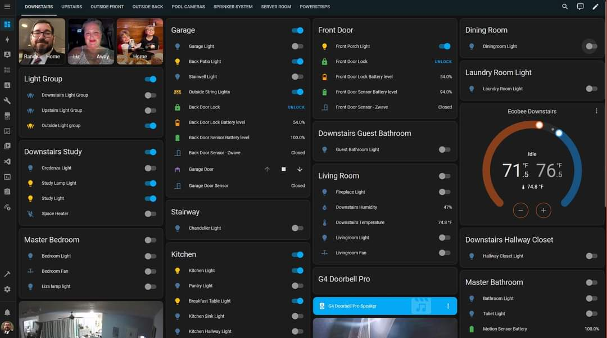

# Another example dashboard

One of the things about dashboards, is that they are very personal. They are meant to fit your needs and although you can take inspiration from other people's dashboards and in some cases copy the yaml to at least get the intricacies, sometimes you just need to look at a dashboard and admire it. In this example, I don't have any yaml.

