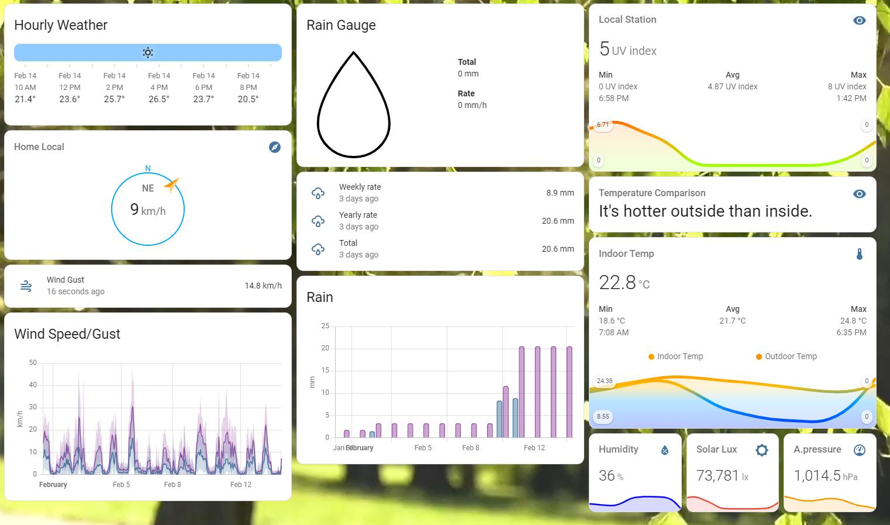
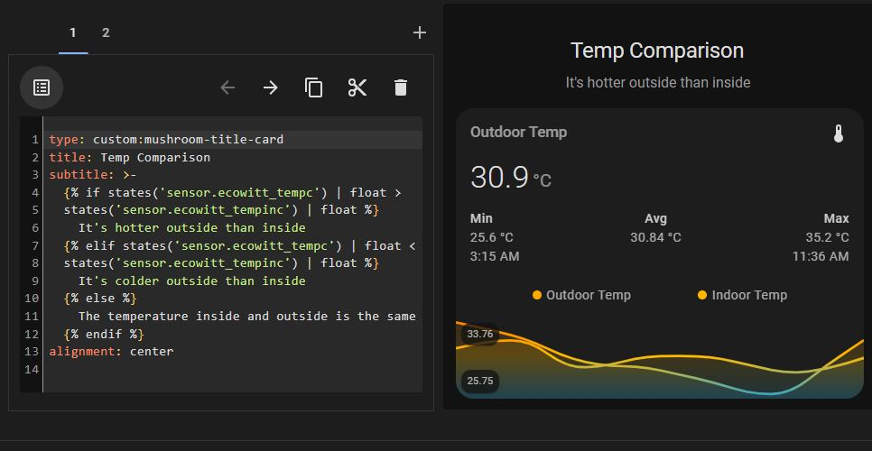

# Interesting local weather dashboard and cards

Thanks to Hannes Nel who posted an example dashboard for his local weather sensor. He hwas an Ecowitt GW1101 and uses those sensors in this dashboard. He's also created a sensor using the template sensor which displays text.

As people asked for one of the indoor-outdoor graphs, I copied the code into the yaml located here.

Someone mentioned the code in the template sendor could be used as a header in  a muschroom card.

