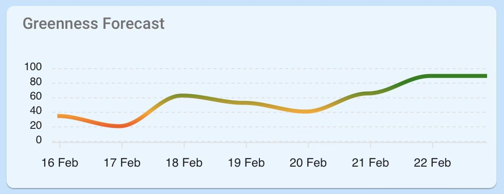

# Octopus Greeness Forecast Card

Mark Burn posted on Facebook a really neat graph. He said

"Octopus now provide a 'Greenness Forecast' that predicts the next 7 days grid greenness. Basically the higher the forecast, the cheaper the smart tariffs are likely to be. I've produced a little code for Apex Charts that will extract the next 7 day forecast from the entity and display it as a simple line graph.
You need to enable the 'greenness_forecast_current_index' entity within your octopus integration and update the entity line in the sample code I've saved to pastebin and it should 'just work'."

I pulled down the code from the pastebin.

[pastebin link](https://pastebin.com/G2MqD1U6)
