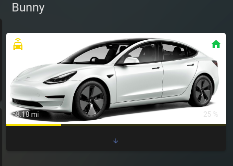
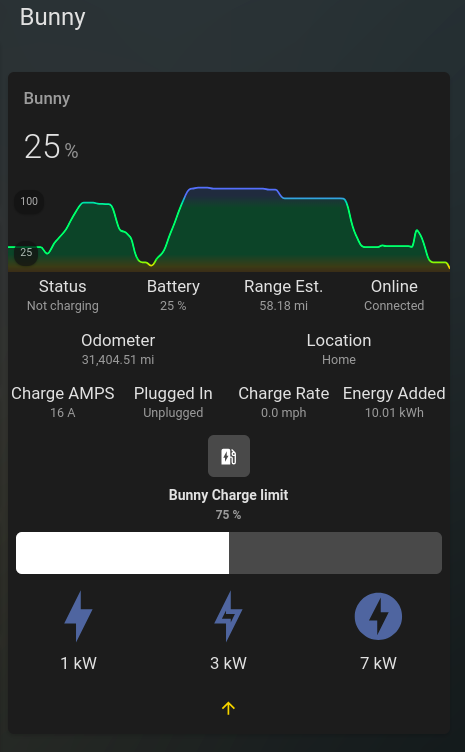

# Vehicle card using Tesla as example

If you have a Tesla it is easy to replicate by simply editing the vehicle name. In my instance it is called "bunny", so you could replace all the sensor.bunny_ sensors, etc with the name of your vehicle.

The other thing you will see is conditionals for certain zones. These are zones that are important to you and you would like to show up in the image with the vehicle. I have multiple grocery stores listed in mine, in addition to home. Just replce them with the zones you have created.

To get the expanded view you need to create a helper which is a boolean type. I called it input_boolean.teslagreydrawer. You can name it however you want, you just need to adjust the code to use the right input_boolean.
